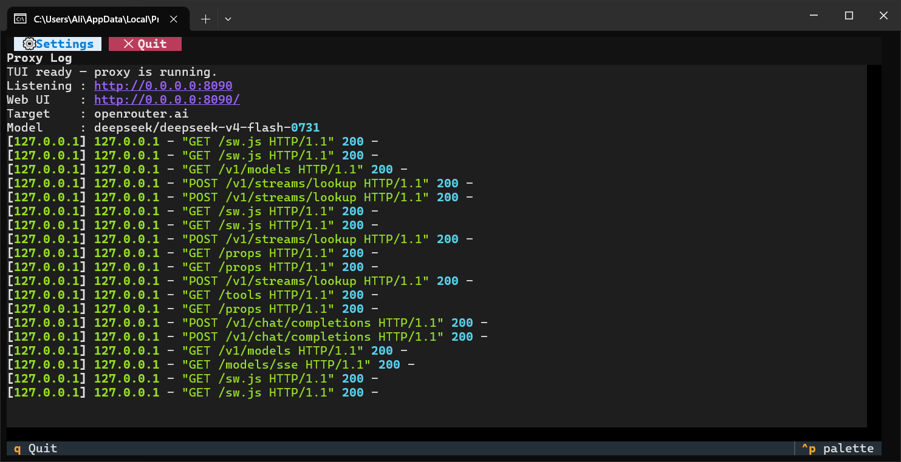
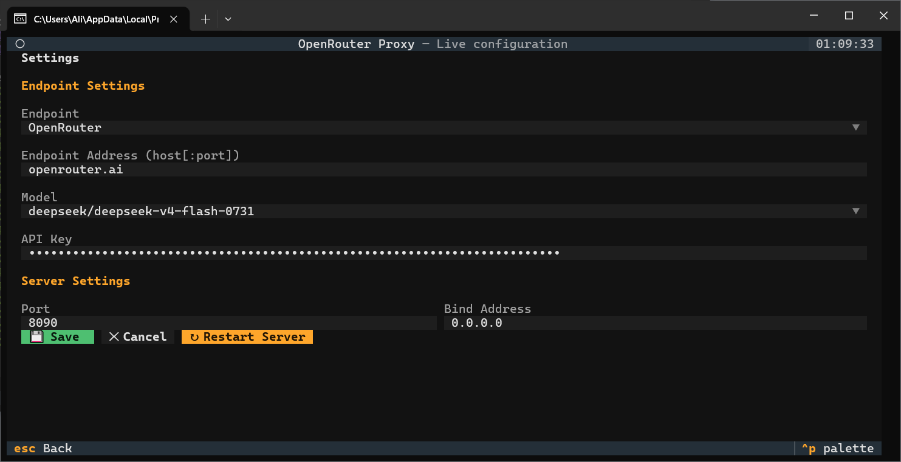
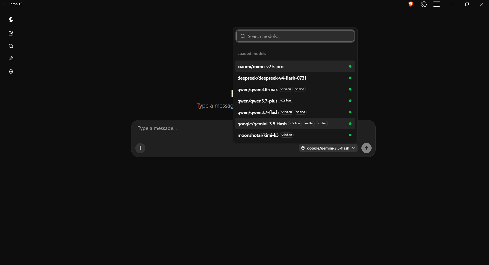

# AI Gateway — Multi-Endpoint OpenAI-Compatible Proxy with Web Chat UI

A multi-endpoint proxy that connects to several AI backends simultaneously — OpenRouter, OrcaRouter, LM Studio, llama.cpp server, and any custom OpenAI-compatible endpoint. It checks their health, aggregates their models into a unified catalog, and routes requests based on model ID prefixes. Works as a single API server for your entire local network.

**Use cases:**
- **Homes** — Share a single paid OpenRouter account with all family devices, while also running local models
- **Testing environments** — Developers and QA can access cloud and local AI without managing individual API keys
- **Cline / AI agents** — Point any agent client to `http://YOUR_PC:8090` and it just works
- **Private chat** — Anyone on the LAN gets a full chat UI without needing their own account

## What It Does

```
┌──────────────────────────────────────────────────────────────┐
│  AI Gateway (192.168.1.100:8090)                             │
│                                                              │
│  proxy.py ─┬─► OpenRouter API ──► Cloud AI Models           │
│            ├─► OrcaRouter API ──► Cloud AI Models           │
│            ├─► llama.cpp :8080 ──► Local GGUF Models        │
│            ├─► LM Studio :1234 ──► Local Models             │
│            ├─► Ollama :11434 ──► Local Models               │
│            └─► Custom Endpoint ──► Any OpenAI-compatible     │
│      │                                                       │
│      ├── Terminal TUI (endpoint mgmt, model switch)         │
│      └── Web Chat UI (browser-based)                        │
│                                                              │
└──────────┬──────────┬──────────┬────────────────────────────┘
           │          │          │
     ┌─────┴──┐  ┌────┴───┐  ┌──┴────────┐
     │ Phone  │  │ Laptop │  │ Cline/Agent│
     │ Web UI │  │ Web UI │  │ API client │
     └────────┘  └────────┘  └────────────┘
```

**Multiple endpoints, one proxy, zero client configuration.**

### Screenshots

| Terminal TUI | Console GUI | Web UI |
|:---:|:---:|:---:|
|  |  |  |

### For AI Agent Users (Cline, etc.)
The gateway exposes both OpenAI-compatible and LM Studio-compatible endpoints. For the best experience with Cline:

1. Select **"LM Studio"** as the API provider in Cline
2. Set the base URL to `http://YOUR_PC_IP:8090` (no `/v1` needed)
3. The model dropdown populates automatically

The proxy handles the API key, model selection, and routing. Switch models from the TUI and all connected agents instantly use the new model.

### For Chat Users
Open `http://YOUR_PC_IP:8090/` in any browser on the network. Full chat interface with conversation management, file attachments, markdown rendering, and model switching — no account needed.

## Quick Start

```bash
# 1. Clone or download this project
# 2. Copy config.example.json to config.json and add your endpoints + API keys
#    (config.json is gitignored — never commit your real API keys)
# 3. Run:
python proxy.py

# That's it. Open http://localhost:8090/ for the chat UI.
# Other devices: http://YOUR_IP:8090/
```

## Model ID Format

Model IDs use a `source/vendor/model` prefix to route requests to the correct endpoint:

```
openrouter/openai/gpt-5.6-luna        → OpenRouter → openai/gpt-5.6-luna
openrouter/deepseek/deepseek-v4-flash  → OpenRouter → deepseek/deepseek-v4-flash
orcarouter/openai/gpt-4o-mini          → OrcaRouter → openai/gpt-4o-mini
orcarouter/anthropic/claude-sonnet-4.6 → OrcaRouter → anthropic/claude-sonnet-4.6
llama.cpp/qwen3-8b                     → llama.cpp server → qwen3-8b
lmstudio/mistral-7b                    → LM Studio → mistral-7b
ollama/llama3                          → Ollama → llama3
```

The `source` prefix is the endpoint name. The rest is the original model ID as known by the upstream endpoint.

## Features

### Proxy Server
- Multi-endpoint support (OpenRouter, OrcaRouter, LM Studio, llama.cpp, Ollama, custom)
- Health checking every 30 seconds with status display
- Automatic model aggregation from all online endpoints
- Smart routing: model ID prefix → correct endpoint
- SSE streaming for all endpoints
- Automatic model injection when client doesn't specify one
- CORS headers for cross-origin access
- Auto-discovery of local endpoints (llama-server on :8080, LM Studio on :1234, Ollama on :11434)

### Terminal Dashboard (TUI)
- Live proxy log showing all requests
- Endpoint status panel (online/offline with model counts)
- Settings with model selection, port, bind address, fetch top models toggle
- Footer key bindings: `s` Settings, `q` Quit, `Ctrl+S` Save, `Ctrl+R` Restart
- Consistent scrollable layout across all screens
- Save/load settings from `config.json`

### Web Chat UI
- Powered by [llama.cpp's llama-ui](https://github.com/ggml-org/llama.cpp/tree/master/tools/ui)
- Streaming responses with real-time token display
- Model selector with all configured models (from all endpoints)
- Conversation management (create, branch, edit, delete, search)
- File attachments (images, PDFs, audio, text)
- Markdown with syntax highlighting and math formulas
- Dark/light theme
- MCP server support (attach tools/resources; "Use llama-server proxy" toggle)

#### Displaying Full Raw Model Identifiers

By default, the model selector shows parsed, human-friendly model names with badges (e.g. `GLM-4.7-Flash` with a `Q8_0` quantization badge). To see the **full raw model identifier** — including the source prefix and the complete upstream model ID — enable the **"Show raw model names"** option:

1. Open the **Settings** screen (gear icon in the sidebar)
2. Go to the **Display** section
3. Toggle **"Show raw model names"** on

When enabled, model names are shown in their complete form, e.g.:

```
openrouter/ggml-org/GLM-4.7-Flash-GGUF:Q8_0
llama.cpp/mistral-7b-instruct-v0.3
lmstudio/llama-3.2-8b-instruct
```

This is especially useful with the AI Gateway's multi-endpoint setup, since the `source/vendor/model` prefix makes it clear which endpoint serves each model. The setting is saved in the browser's localStorage and applies immediately.

## MCP Servers (Tools & Resources)

The web UI can attach **MCP servers** to the chat so the model can call external tools and read resources. HTTP/S MCP servers (Streamable HTTP or SSE) are added by URL in the MCP Servers screen.

- **"Use llama-server proxy"** — routes the MCP server's traffic through the gateway's `/cors-proxy` endpoint, bypassing browser CORS/mixed-content restrictions. Enable this for local HTTP MCP servers or any server that doesn't send CORS headers.
- **Session support** — the proxy forwards the MCP session handshake (`Mcp-Session-Id`) so stateful MCP servers work.

> **Command/stdio servers** (e.g. `@modelcontextprotocol/server-filesystem`) are not spawned by the gateway. To use one, bridge it to HTTP first — for example with [supergateway](https://github.com/supercorp-ai/supergateway):
>
> ```
> npx -y supergateway --stdio "npx -y @modelcontextprotocol/server-filesystem C:\path\to\folder" --port 8099 --outputTransport streamableHttp --stateful
> ```
>
> Then add `http://localhost:8099/mcp` as the MCP URL with the proxy toggle on.

## Configuration

Edit `config.json`:

```json
{
  "endpoints": [
    {
      "name": "openrouter",
      "type": "openrouter",
      "host": "openrouter.ai",
      "enabled": true,
      "api_key": "sk-or-v1-YOUR_KEY_HERE"
    },
    {
      "name": "orcarouter",
      "type": "orcarouter",
      "host": "api.orcarouter.ai",
      "enabled": true,
      "api_key": "sk-orca-YOUR_KEY_HERE"
    },
    {
      "name": "llama.cpp",
      "type": "llama-server",
      "host": "localhost:8080",
      "enabled": true,
      "api_key": ""
    },
    {
      "name": "ollama",
      "type": "ollama",
      "host": "localhost:11434",
      "enabled": true,
      "api_key": ""
    },
    {
      "name": "llamastash",
      "type": "custom",
      "host": "localhost:11435",
      "enabled": true,
      "api_key": ""
    }
  ],
  "models": [
    "openrouter/openai/gpt-5.6-luna",
    "openrouter/deepseek/deepseek-v4-flash-0731",
    "openrouter/deepseek/deepseek-v4-flash-vision-exp",
    "openrouter/z-ai/glm-5.3-flash",
    "openrouter/google/gemini-3.5-flash"
  ],
  "model_index": 0,
  "port": 8090,
  "addr": "0.0.0.0",
  "fetch_top_models": false
}
```

| Field | Description |
|-------|-------------|
| `endpoints` | List of AI backends (name, type, host, api_key, enabled) |
| `models` | Your curated model list with `source/model` prefix format |
| `model_index` | Default model (0-based index into `models`) |
| `port` | HTTP port (default: 8090) |
| `addr` | Bind address (`0.0.0.0` = all interfaces) |
| `fetch_top_models` | When `true`, fetches top 20 intelligent models from OpenRouter and merges with your models |

### Endpoint Types

| Type | Description | Health Check |
|------|-------------|-------------|
| `openrouter` | OpenRouter cloud API | `GET /api/v1/models` |
| `orcarouter` | OrcaRouter cloud API | `GET /api/v1/models` |
| `lmstudio` | LM Studio local server | `GET /v1/models` |
| `llama-server` | llama.cpp server | `GET /health` |
| `ollama` | Ollama local server | `GET /api/tags` |
| `custom` | Any OpenAI-compatible endpoint (e.g. llamastash) | `GET /v1/models` |

## Connecting Clients

### Cline (Recommended)
Use the **LM Studio** provider in Cline for automatic model discovery:
1. **API Provider**: Select "LM Studio"
2. **Base URL**: `http://YOUR_PC_IP:8090`
3. **API Key**: Leave empty — the proxy handles it

The model dropdown will populate automatically with all models from the gateway.

### Cline (Alternative)
Use the **OpenAI Compatible** provider:
- **Base URL**: `http://YOUR_PC_IP:8090/v1`
- **API Key**: Any non-empty string (e.g., `sk-placeholder`)

### Any OpenAI-compatible client
- **Base URL**: `http://YOUR_PC_IP:8090/v1`
- **API Key**: Leave empty or use anything — the proxy uses its own key

### Web Browser
Open `http://YOUR_PC_IP:8090/`

## Building the Web UI

The web UI only needs to be built once. After building, Python serves the static files directly — no Node.js runtime needed. The bundled `webui/` already contains a pre-built copy, so this step is only required when you want to update it.

```bash
# First-time setup: clone the llama.cpp source (the build script expects it here)
git clone https://github.com/ggml-org/llama.cpp.git webui-src

# Option A: Build from the cloned llama.cpp source
build-webui.cmd

# Option B: Use pre-built files from a local llama.cpp build
# Copy <llama.cpp>/build/tools/ui/dist/ contents to webui/
```

## Project Structure

```
.
├── proxy.py              # Main application (proxy + TUI + static server)
├── config.example.json   # Committed template — copy to config.json
├── config.json           # Your settings (endpoints, models, port) — gitignored
├── build-webui.cmd       # One-click web UI build script
├── run.cmd               # Quick-start batch file
├── webui/                # Built web UI static files
├── webui-src/            # llama.cpp source (gitignored, see "Building the Web UI")
├── testing/              # Automated test suite (python testing/test_proxy.py)
├── .gitignore
└── README.md
```

## Testing

The project ships an automated test suite for the proxy's MCP support, using Python's built-in `unittest` (no third-party test runner required):

```bash
python testing/test_proxy.py
```

The tests spin up an in-process mock MCP server and an ephemeral gateway, then assert on `/props`, `/cors-proxy` forwarding, header precedence, the MCP session handshake, and error handling — no running gateway, online model, or API key needed.

## Prerequisites

- **Python 3.8+**
- **Node.js 20+** (only for building the web UI, not for running)

## How Model Aggregation Works

On startup, the proxy:
1. Auto-discovers local endpoints (llama-server on :8080, LM Studio on :1234, Ollama on :11434)
2. Checks health of all configured endpoints
3. For OpenRouter: includes only your curated `models` list (not the full 340+ catalog)
4. For local endpoints: includes all discovered models (typically 1-5 loaded models)
5. Builds a unified model list with source-prefixed IDs
6. Refreshes every 30 seconds via the health check loop

## Tested Backends

| Backend | Status | Notes |
|---------|--------|-------|
| OpenRouter | ✅ Tested | Full support — streaming, model switching, metadata |
| OrcaRouter | ✅ Tested | OpenAI-compatible gateway — streaming, tools, vision, multi-provider routing |
| LM Studio | ✅ Tested | Works as upstream OpenAI-compatible endpoint |
| llama.cpp server | ✅ Tested | Health check via `/health`, model info via `/props` |
| Ollama | ✅ Tested | Health check via `/api/tags`, model discovery, OpenAI-compatible chat API |
| vLLM | ⏳ Pending | Expected to work (OpenAI-compatible API) |

## LM Studio Compatible

This proxy exposes LM Studio-compatible endpoints (`/api/v0/models`, `/api/v1/models`) alongside the standard OpenAI-compatible endpoints (`/v1/models`). This means:

- **Cline's LM Studio provider** can auto-discover models from the gateway
- **Any LM Studio-compatible client** can connect and get access to cloud models through OpenRouter
- **The web chat UI** works with all models from all endpoints

### API Endpoints

| Endpoint | Format | Purpose |
|----------|--------|---------|
| `GET /v1/models` | OpenAI standard | Standard clients, OpenAI Compatible provider |
| `GET /api/v0/models` | LM Studio | Cline LM Studio provider, LM Studio clients |
| `GET /api/v1/models` | LM Studio | Alias for `/api/v0/models` |
| `POST /v1/chat/completions` | OpenAI standard | Chat completions (proxied to correct endpoint) |

## License

This project wraps OpenRouter's API. The web UI is from the [llama.cpp](https://github.com/ggml-org/llama.cpp) project (MIT License).